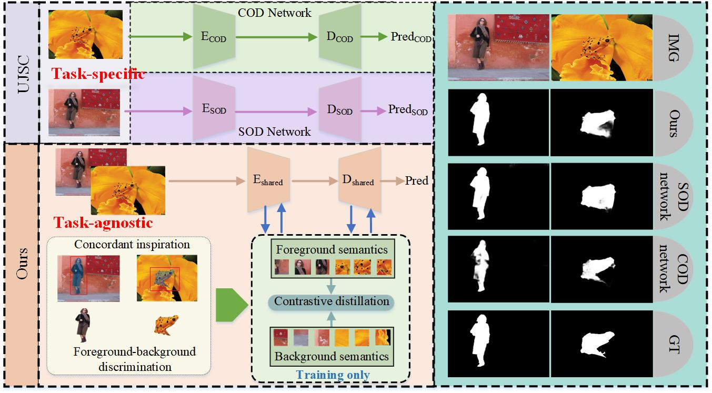

# Seamless-Detection

We make the study to unify SOD and COD in a task-agnostic framework via a contrastive distillation paradigm, inspired by their agreeable nature of binary segmentation.

# 💥 News 💥
- [13.2.2025] [Seamless-Detection](https://www.sciencedirect.com/science/article/abs/pii/S0957417425005342) has been accepted to ESWA 2025 !
- [16.12.2024] Paper is now available on arXiv !
- [04.9.2024] We have released the code and model checkpoints for Seamless-Detection !
# Quick Start
Code is available now!

Pretrained backbone:[MoCo-v2](https://github.com/facebookresearch/moco).

# Requirements
python 3.9

pytorch 1.11.0

tensorboardX 2.5

# Citation
If you find Seamless-Detection to be useful for your work, please consider citing our paper:

` @article{liu2025seamless,
   title={Seamless Detection: Unifying Salient Object Detection and Camouflaged Object Detection},
   author={Liu, Yi and Li, Chengxin and Dong, Xiaohui and Li, Lei and Zhang, Dingwen and Xu, Shoukun and Han, Jungong},
   journal={Expert Systems with Applications},
   pages={126912},
   year={2025},
   publisher={Elsevier}
` }
